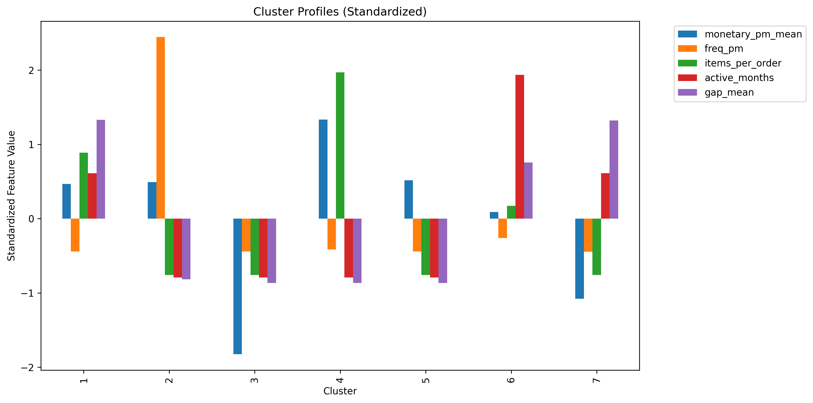
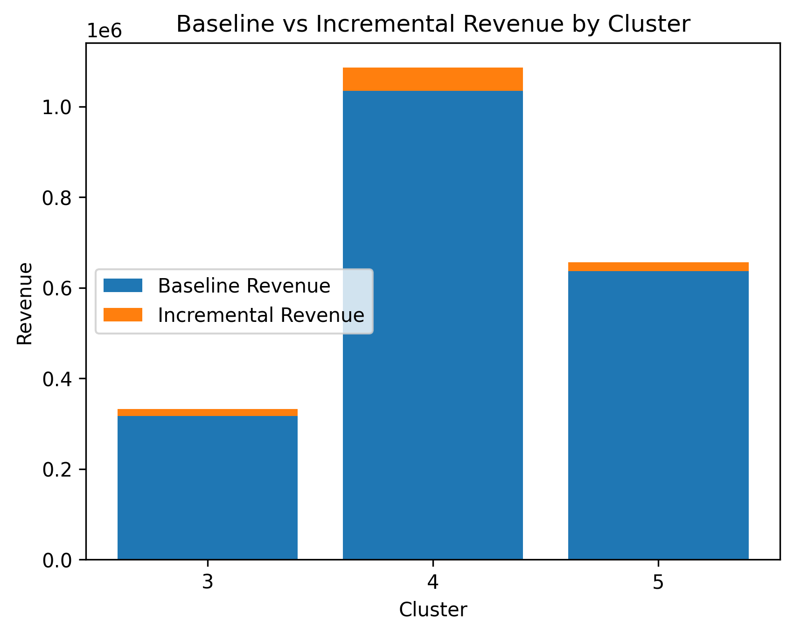

# PROJECT - CUSTOMER SPENDING SEGMENTATION
## PROJECT OVERVIEW
This project focuses on customer spending segmentation using transactional e-commerce data. The objective is to identify distinct customer segments based on purchasing behavior and translate these segments into actionable business strategies with quantified revenue impact.

The project is designed as an end-to-end data science case study, covering data extraction, feature engineering, unsupervised modeling, cluster interpretation, and scenario-based business impact estimation.

## BUSINESS PROBLEM
Retail companies treats all customers uniformly despite large differences in their revenue contribution and purchasing behavior, leading to inefficient allocation of marketing resources and increased revenue risk. The objective of this project is to identify customer segments that differ in both revenue contribution and revenue stability, enabling value-aware and risk-aware business strategies.

This project answers the following questions:

- Can we segment customers based on spending and purchasing patterns?
- Which customer segments contribute most to revenue?
- What targeted actions could improve revenue and retention?
- What is the estimated business impact of these actions?

## DATA SOURCE
- Platform: Google BigQuery
- Data Type: Transaction-level e-commerce data

Raw Columns:
- user_id
- order_id
- product_id
- sale_price
- delivered_at

The dataset represents historical customer purchase behavior and does not include marketing exposure, churn labels, or future outcomes.

## FEATURE ENGINEERING
Customer-level features were engineered from transactional data to capture spending intensity, frequency, and engagement patterns.

Key Features Created:

- Recency-Frequency-Monetary (RFM) metrics
- Average Order Value (AOV)
- Average items per order
- Customer lifespan
- Active months
- Frequency per active month
- Monetary value per active month
- Mean inter-purchase gap
- Standard deviation of inter-purchase gaps

Highly correlated features were identified and removed to reduce redundancy while preserving interpretability.

## DATA PREPROCESSING
- Duplicate records checked and removed.
- Missing values inspected.
- Outliers examined and retained when behaviorally valid.
- Feature transformation and scaling applied to prepare data for clustering.
- Outliers were intentionally retained where they represented genuine high-value customer behavior.

## MODELLING APPROACH
ALGORITHM:

HDBSCAN model was initially trained but discarded later, because the persistence metric did not differentiate cluster importance; the method was not suitable for revenue-based prioritization. 
Gaussian Mixture Model (GMM) was chosen for clustering due to its ability to:
- Model clusters with different shapes and variances
- Provide probabilistic cluster assignments

MODEL OUTPUT:

- Optimal solution resulted in 7 distinct customer clusters.
- Each cluster was profiled using aggregated behavioral metrics.

## CLUSTER INTERPRETATION
Each cluster was analyzed and labeled based on spending, frequency, and engagement patterns. Example cluster types include:

- One-time high-value bulk buyers
- One-time premium product buyers
- Low-value mass customers
- Infrequent high-value repeat customers
- Dormant or weakening engagement customers

Three clusters were found to contribute approximately 87% of total company revenue, highlighting strong revenue concentration.

## BUSINESS INSIGHTS AND STRATEGIES
Cluster-specific business objectives and recommended actions were defined, such as:

- Encouraging repeat purchases among one-time high-value buyers
- Basket expansion through accessory cross-selling for premium buyers
- Incentivizing second purchases among low-value mass customers
- Each strategy targets a specific behavioral lever: retention, purchase frequency, or basket size.

## IMPACT ESTIMATION (SCENARIO-BASED)
To quantify business value, counterfactual scenarios were constructed under realistic assumptions:

- Partial customer adoption of strategies
- No increase in customer acquisition costs
- No causal claims

Estimated incremental revenue was calculated for priority clusters and aggregated to estimate company-level impact.

## KEY RESULT
Cluster-based interventions could conservatively increase revenue by ~3.8 % under the assumed scenarios.

## KEY TAKEAWAYS
- A small subset of customer segments drives the majority of revenue.
- Targeted, cluster-specific strategies offer higher ROI than blanket campaigns.
- Converting one-time high-value buyers into repeat customers yields the largest estimated impact.
- Basket expansion among premium buyers provides incremental revenue without relying on long-term retention assumptions.

## ASSUMPTIONS AND LIMITATIONS
- Impact estimates are scenario-based and do not imply causality.
- No post-intervention or future data was available.
- Customer lifetime value and explicit churn labels were not present.
- Seasonal effects and marketing costs were not included.

## Tools & Technologies
- Python (pandas, numpy, scikit-learn)
- SQL (Google BigQuery)
- Matplotlib / Seaborn for visualization
- VS Code for development

## Next Steps (Future Work)
- Validate cluster stability across samples.
- Compare GMM with alternative clustering algorithms.
- Deploy strategies and evaluate via A/B testing.
- Track KPIs such as repeat purchase rate, AOV, and retention over time.